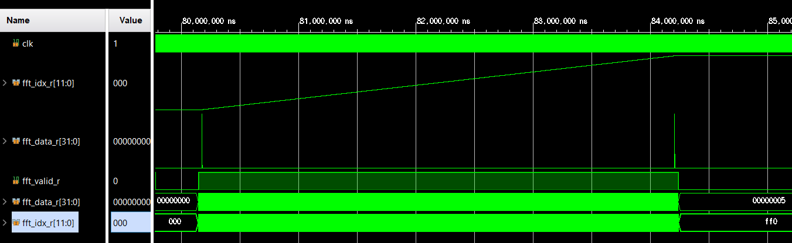

# vcd2csv
Convert VCD(value change dump) to CSV file\
vcd to csv conversion

Reference: https://github.com/cirosantilli/vcdvcd

Pre-requisite: vcdvcd

Usage:\
> python vcd2csv.py a.vcd\
> python vcd2csv.py a.vcd -c out.csv\
> python vcd2csv.py -h

    ### How to dump signals at Vivado Simulator
    [ Vivado Tcl Console ]
    * open_vcd xsim_dump.vcd
    * log_vcd /tb_system_body/inst_system_body/i_process_top/clk
    * log_vcd /tb_system_body/inst_system_body/i_process_top/fft_data_r
    * log_vcd /tb_system_body/inst_system_body/i_process_top/fft_idx_r
    * log_vcd /tb_system_body/inst_system_body/i_process_top/fft_valid_r
    * run 100us
    * close xsim_dump.vcd \
    file saved at project_adc.sim\sim_1\behav\xsim
        

